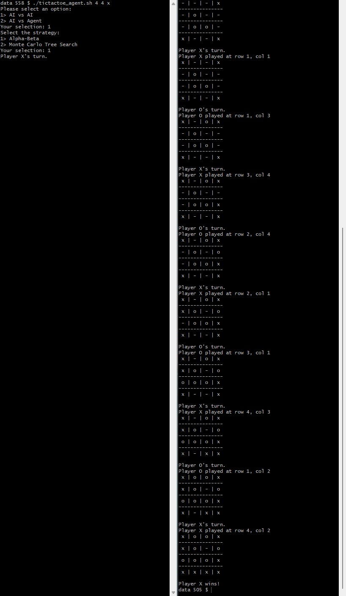
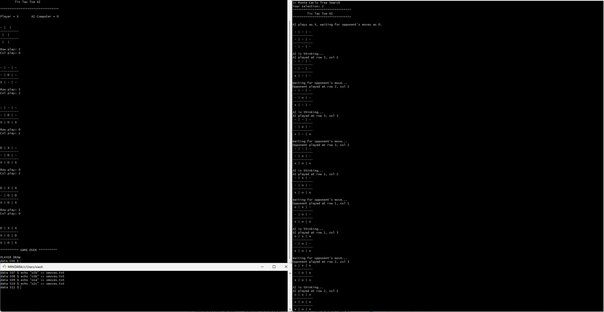

# Tic Tac Toe Agent

This repository contains the source code for a Tic Tac Toe game with AI capabilities using Alpha-Beta Pruning and Monte Carlo Tree Search algorithms.

## File Structure
- `main.py` - Main executable Python script.
- `TicTacToe.py` - Contains the logic for the Tic Tac Toe game.
- `utils.py` - Helper functions and utilities.
- `tictactoe_agent.sh` - Shell script to run the game with different configurations.
- `test.cpp` - The code of another agent which I get from [github](https://github.com/GeorgeSeif/Tic-Tac-Toe-AI?tab=readme-ov-file) for problem 1 part 2 Q 2.
- `README.txt`
- `compare2.png` - The image of the game example.

## Prerequisites
Ensure you have Python3 installed on your system. 
The shell script should be executable; if not, you can make it executable by running:
```
chmod +x tictactoe_agent.sh
```
and if you want to test my agent with the other agent (test.cpp) which i get from [Here](https://github.com/GeorgeSeif/Tic-Tac-Toe-AI?tab=readme-ov-file), you should compile the test.cpp by using C++11
```
std=c++11 test.cpp -o test
```

## How to Run the Game
### Starting the Game
the environment is an n × n grid, the rules are that you may place a piece (either x or o) on any unoccupied square, and the goal is to get k of your pieces in a row

```
usage: ./tictactoe_agent.sh n k [x/o]
```
For example:
```
./tictactoe_agent.sh 3 3 x
```
means that the game is played on a 3x3 board, and the player with the mark 'x' go first, and the player who gets 3 marks in a row wins.

### Selecting the Mode and Strategy
then you will be asked to choose the game mode, and there are 2 modes to play the game, for each mode you will be asked to choose the strategy you want to use and there are 2 strategies to choose from. 

For example I choose AI vs AI mode and Alpha-Beta strategy:
Mode:
```
Please select an option:
   1> AI vs AI
   2> AI vs Agent
   Your selection: 1
```
Strategy:
```
Select the strategy:
   1> Alpha-Beta
   2> Monte Carlo Tree Search
   Your selection: 1
```

## Game Mode Explanation
### AI vs AI Mode
To run the game in AI vs AI mode means that the game will be played between two AI agents by using the selected strategy automatically. (Actually, for this program, the program will paly against itself.)

### AI vs Agent Mode
AI vs Agent mode means that the game will be played between this AI agent with the selected strategy and other agents that you can write manually. For example, you can write another agent in any language you want, and you can play it with my AI agent by writing the position of the other agent manually to the file `omoves.txt` and my AI agent will read it and play its move.

One example of the process of the game is as follows:
1. Run the `tictactoe_agent.sh` script with the game configuration:
```
./tictactoe_agent.sh 3 3 x
```
2. Select the game mode:
```
Please select an option:
   1> AI vs AI
   2> AI vs Agent
   Your selection: 2
```
3. Selct the Strategy:
```
Select the strategy:
   1> Alpha-Beta
   2> Monte Carlo Tree Search
   Your selection: 2
```
then the agent will play the first move by placing its mark on the board, and waiting for the other agent to play.
4. Open other agent to play with the AI agent:
For example, test.cpp is the other agent by using Alpha-Beta pruning, you can run it by:
```
./test 
```
Manual input the position you get from my AI agent from step 3, and this agent will play its move.
5. Write the position you get from the other agent to my AI agent, and my AI agent will play its move.
For example, if the other agent played at row 2, col 2, then you should write it to my AI agent manually by using the following command:
```
echo "o2b" >> omoves.txt
```
6. Then my agent will play its move, and repeat the process until the game ends.


## Game Examples
### AI vs AI Mode
left is Alpha-Beta strategy, and right is Monte Carlo Tree Search strategy on 4x4 board with 4 marks in a row, x goes first.


### AI vs Agent Mode


